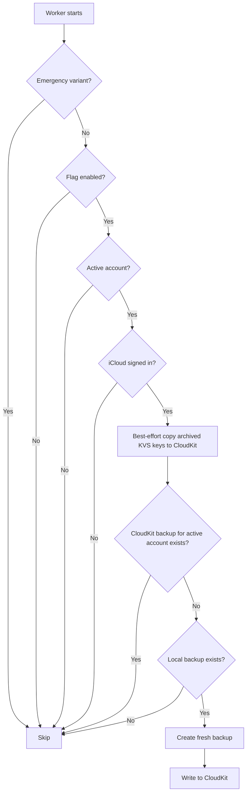

This module contains domain specific components for creating and recovering Keybox from customer's Cloud Storage.

Cloud Storage access is abstracted away and managed by `:libs:cloud-store` components.

## Cloud Backup Versioning

### Core Principles

1. **Immutable Versions**: Never modify existing backup data classes (`CloudBackupV2`, `CloudBackupV3`, etc.). Each
   version is a
   complete, immutable snapshot.

2. **Forward Compatibility**: New app versions must support reading all previous backup versions.

3. **Migration is not (currently) automatic**: Consider whether existing backups must be updated to the newest version, and if so evaluate automation such as via `CloudBackupHealthRepository`

### Creating a New Backup Version

When schema changes are needed:

1. Create a new data class (e.g., `CloudBackupV4`) implementing `CloudBackup`
2. Update `CloudBackupService`, `CloudBackupDao` to support daisy chain decoding
3. Create a version-specific restorer (e.g., `CloudBackupV4Restorer`)
4. Update the very many exhaustive `when` statements throughout the app
5. Update cloud backup creators e.g. `FullAccountCloudBackupCreator` to create the new format
6. Update the `isLatestVersion` extension function in `CloudBackup.kt` to return `false` for the old version and `true`
   for the new version
7. Consider whether automatic migration to the newest version is needed (see `CloudBackupVersionMigrationWorker`)

### Reading Backups (Daisy Chain Pattern)

Json strings are decoded into CloudBackups in multiple places. See `CloudBackupService` and `CloudBackupDao`. 

Implementations should daisy-chain decode, starting with the most recent version:

```kotlin
// V2 was the latest
return Json.decodeFromStringResult<CloudBackupV2>(backupEncoded)

// After adding V3, try V3 first then fallback to V2
return Json.decodeFromStringResult<CloudBackupV3>(backupEncoded)
   .orElse { Json.decodeFromStringResult<CloudBackupV2>(backupEncoded) }
   .mapError { ... }
```

### Testing Requirements
- Test reading each backup version
- Test migration paths between versions
- Test restoration from each version. See `CloudBackupV2RestorerImplTests` and `CloudBackupV3RestorerImplTests` for
  examples.

### CloudBackupV3 Changes

CloudBackupV3 adds the following fields to CloudBackupV2:

- `deviceNickname: String?` - Optional device identifier/nickname
- `createdAt: Instant` - Timestamp of when the backup was created

## CloudKit migration (iOS)

When `IosCloudKitBackupFeatureFlag` is enabled, we populate CloudKit with backup data for
existing accounts on iOS. Active backup migration creates a fresh backup using the latest
schema. In addition, archived backup keys already present in iCloud KVS are copied to CloudKit
on a best-effort basis.

### Migration flow



- Runs at app startup only.
- Only runs when there is an active account and a signed-in iCloud account.
- Uses the remote CloudKit read as source of truth for migration need.
- First best-effort copies historical archived backup keys from iCloud KVS into CloudKit when missing there
  (for example `cb-<account-id>-<timestamp>` and `cloud-backup-<timestamp>`).
- Skips if CloudKit already has an active backup for the active account.
- If CloudKit has an active backup for a different account ID, logs the mismatch and continues migration for the active account.
- Recreates the backup locally (via `FullAccountCloudBackupCreator` / `LiteAccountCloudBackupCreator`) and uploads using
  `CloudBackupService.writeBackup` with `requireAuthRefresh = false`.
- Does not maintain additional local migration markers or local migration state.
- Does **not** delete or modify legacy KVS backups (mirroring continues for now).
