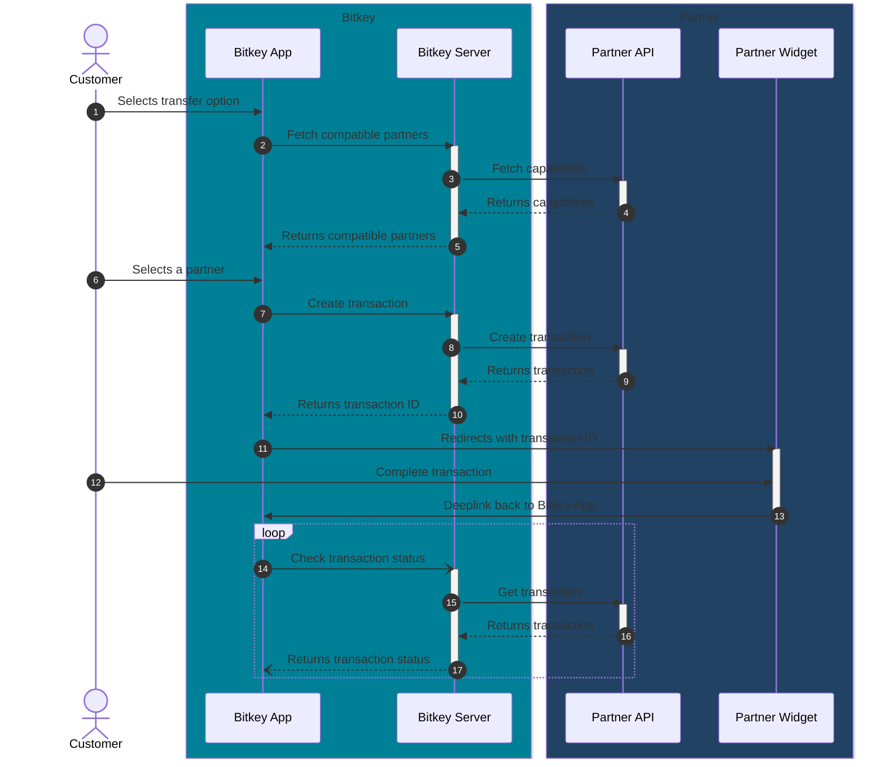
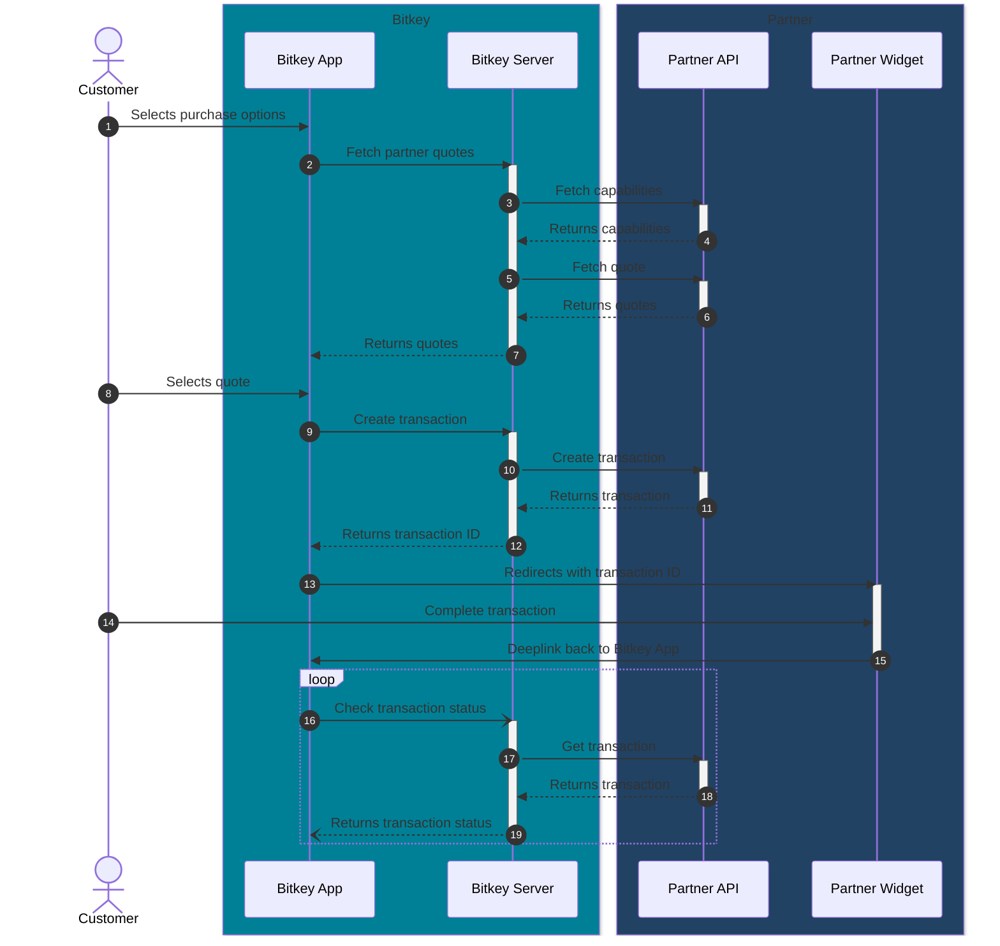
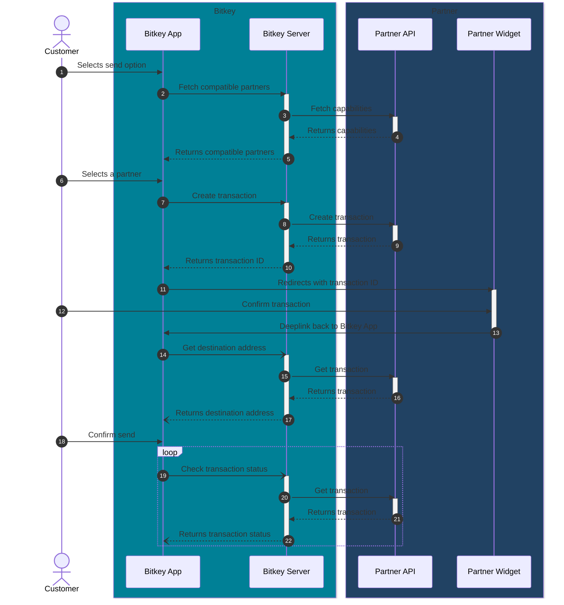
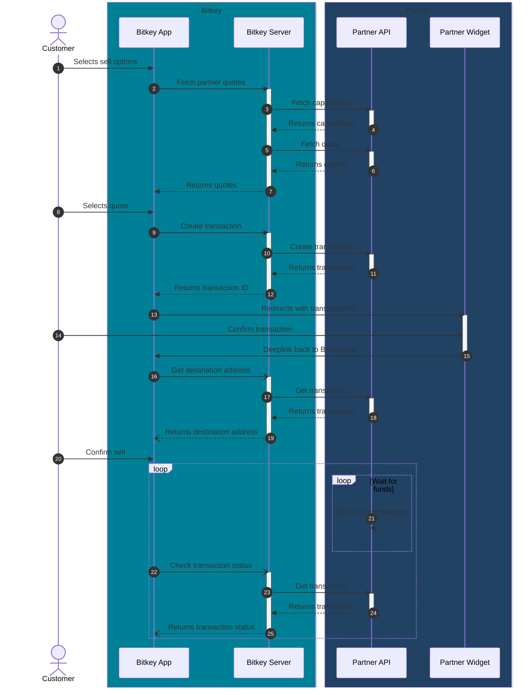

# Bitkey Partnerships

## Overview

Bitkey strives to make it easy for customers to take ownership of their bitcoin, easily transact on the bitcoin network, and to effortlessly convert bitcoin to and from their local currency.  We’ve created the Bitkey Partnership initiative to integrate our Bitkey wallet with partners that provide bitcoin-fiat conversions.

When a customer wants to add funds to their Bitkey wallet, they have the option to transfer existing funds or purchase new bitcoin using fiat. To complete this transaction, customers can choose from a list of integrated partners. After selecting a partner, Bitkey will switch to the partner experience - via an embedded mobile page or by deeplinking to the partner app - that enables customers to complete the transaction using the partner-owned experience. Once the transaction is complete, customers will return to the Bitkey wallet experience where they will see an acknowledgment of their transaction and wait for the arrival of the bitcoin.

Similarly, customers can move funds to an integrated partner with the option to sell their bitcoin for fiat. Customers will be able to initiate the transaction within their Bitkey wallet and confirm it via a partner-owned experience. Once confirmed, customers will return to their Bitkey wallet and trigger the funds transfer.

## Integration Principles

### 1. Security

Our priority is to ensure that the customer's funds are secure at all times. We aim to protect customers from man-in-the-middle attacks, phishing attempts, and other forms of fraud. To achieve this, all server-to-server API calls must be authenticated and encrypted, using methods like OAuth 2.0 for authentication and TLS/SSL for encryption. No sensitive information, such as wallet addresses or personal data, should ever be transmitted in clear text. Additionally, we want to ensure that customers are always aware of the partner they are interacting with and that these partners are trusted entities.

### 2. Separation of Ownership

We want it to be clear to our joint customers when they’re interacting with Bitkey versus interacting with the partner. We’ve chosen to switch to a partner owned experience, rather than handling transactions in the background via APIs.

### 3. No personal information in Bitkey

As a self-custody wallet, we do not collect or pass any information about our users. All sign-in, KYC, email/SMS notifications associated with these transactions are handled by the partner. Moreover, we don’t want this information passed to us in any of the API calls.

### 4. Aggregate Reporting

To ensure that we are able to continuously improve the customer experience, we want to be able to track the following metrics on an aggregate level: transaction amounts, new customer sign ups originating from Bitkey, abandoned transactions, and the variance between the quoted price and the transaction price.

## Integration Basics

To integrate with Bitkey, partners need to provide two main components:

### 1. Partner API

Partners need to provide an API that Bitkey's server will use to interact with the partner's system. This API will be used to:

- Get the [Capabilities](#capabilities) of the partner
- Create and retrieve [Transactions](#transactions)
- Get [Quotes](#quotes) for purchase and sell transactions

#### Recommended API implementation

Bitkey recommends and has out-of-the-box support for the following API implementation: [Bitkey Partner API](./bitkey-partner-api.yml)

If the partner chooses to implement the recommended API, Bitkey will be able to integrate the partner faster and with fewer issues.

#### API Components

If the partner chooses to implement a custom API, the following components are required:

##### Authentication

All requests to the partner API must be authenticated. Bitkey will review the partner's authentication mechanism and provide feedback if necessary.

We recommend ECDSA signature verification which is supported by Bitkey out-of-the-box. See the [Recommended API implementation](#recommended-api-implementation) section for more details.

##### Capabilities

The partner API must expose an endpoint that returns the capabilities of the partner. This endpoint will be used by Bitkey to determine which partners are compatible with the customer's request. Bitkey may cache these results to reduce the number of requests to the partner API.

The capabilities endpoint will give Bitkey the following information:

- Types of supported transactions (`PURCHASE`, `SELL`, `RECEIVE` or `SEND`)
  - See [Transaction Types](#transaction-types) for more details
- Supported countries and currencies
- Supported payment methods
- Minimum and maximum transaction amounts

For example, a partner may support purchasing but not selling bitcoin for USD. The capabilities endpoint will allow Bitkey to filter out partners that do not support the customer's request.

##### Transactions

A transaction represents an exchange between bitcoin and fiat currency facilitated by Bitkey and an integrated partner. The partner must expose functionality to allow Bitkey to create and retrieve transactions.

Transactions will be used to:

- Facilitate the exchange of wallet addresses in a private and secure manner
  - NOTE: Sending funds to Bitkey requires sending to Bech32m addresses (pay to Taproot support)
- Provide a mechanism for the partner to notify Bitkey when a transaction's status changes
- Pass any other information to the Partner Widget like transaction amounts

###### Transaction Types

1. `RECEIVE`: A receive transaction represents the movement of bitcoin from the customer's partner account to their Bitkey wallet.
2. `SEND`: A send transaction represents the movement of bitcoin from the customer's Bitkey wallet to their partner account.
3. `PURCHASE`: A purchase transaction represents the exchange of fiat currency to get bitcoin in the Bitkey wallet via the customer's selected partner.
4. `SELL`: A sell transaction represents the exchange of bitcoin from the customer's Bitkey wallet to get fiat currency in the customer's account.

##### Quotes

The partner API must expose an endpoint that returns quotes for purchase and sell transactions. The quotes must list all the fees and the net amount that the customer will receive.

### 2. Partner Widget or App

An embedded web page within the Bitkey App or a deep-linkable section in the Partner's App that allows customers to complete their transactions directly with the partner. Customers should be able to sign in if they are existing partner customers or sign up including full onboarding and KYC experience.

Note: The only required data passed to the Partner Widget or App should be the transaction ID. The Partner Widget or App must not receive any sensitive information about the customer or the transaction via query params.

#### Tamper Detection

The Partner Widget or App must verify the integrity of the data passed by Bitkey to ensure that the data has not been tampered with.

We recommend ECDSA signature verification which is supported by Bitkey out-of-the-box. A public key in DER format will be provided by Bitkey. See the [Recommended API implementation](#recommended-api-implementation) section for more details.

## Integration Flows

### Transfer existing bitcoin to Bitkey

- Capabilities
  - Bitkey Requests Capabilities: Bitkey will request the partner's capabilities for the customer's country.
  - Support Requirements: The partner must support the `RECEIVE` transaction type.
- Transactions
  - Bitkey Creates Transaction:
    - External ID: A unique identifier provided by Bitkey to fetch the transaction later.
    - Type: TRANSFER
    - Destination Address: The Bech32m address of the customer's Bitkey wallet.
  - Partner updates the transaction:
    - Redirect URL: URL for the Partner Widget.
    - Updates URL: URL that the customer can use to check the transaction's status.
    - Crypto Amount: The amount of bitcoin to be transferred.
    - Status:  The current status of the transaction.
- Quotes
  - Not Required: Quotes are not necessary for this transaction type.
- Partner Widget
  - Customer Interaction:
    - The Partner Widget allows the customer to select the amount of bitcoin to send to the destination address.
    - The widget must clearly articulate any fees and the final bitcoin amount to be sent to Bitkey.
    - The customer confirms the transaction and is then returned to the Bitkey App.

#### Receive Transaction Sequence Diagram

### Purchase bitcoin with fiat and transfer to Bitkey

- Capabilities
  - Bitkey Requests Capabilities: Bitkey will request the partner's capabilities for the customer's country.
  - Support Requirements: The partner must support:
    - The `PURCHASE` transaction type.
    - The customer's selected currency.
    - The customer's selected payment method.
    - The customer's selected amount.
- Transactions
  - Bitkey Creates Transaction:
    - External ID: A unique identifier provided by Bitkey to fetch the transaction later.
    - Type: `PURCHASE`
    - Destination Address: The Bech32m address of the customer's Bitkey wallet.
    - Fiat Amount: The amount of fiat the customer desires to pay.
  - Partner Updates Transaction:
    - Redirect URL: URL for the Partner Widget.
    - Updates URL: URL that the customer can use to check the transaction's status.
    - Fiat Amount: The actual amount of fiat paid by the customer.
    - Crypto Amount: The amount of bitcoin to be transferred.
    - Status: The current status of the transaction.
- Quotes
  - Request Quote: Bitkey requests a quote for the customer's selected amount.
  - Partner Provides Quote:
    - Crypto Amount: Net amount of bitcoin to be transferred.
    - Fees: Fees associated with the transaction.
- Partner Widget
- Customer Interaction:
  - The Partner Widget allows the customer to finalize the amount of fiat to pay and the payment method.
  - The widget must clearly articulate any fees and the final bitcoin amount to be sent to Bitkey.
  - The customer confirms the transaction and is then returned to the Bitkey App.

#### Purchase Transaction Sequence Diagram

### Transfer bitcoin to partner

- Capabilities
  - Bitkey Requests Capabilities: Bitkey will request the partner's capabilities for the customer's country.
  - Support Requirements: The partner must support the `SEND` transaction type.
- Transactions
  - Bitkey Creates Transaction:
    - External ID: A unique identifier provided by Bitkey to fetch the transaction later.
    - Type: `SEND`
  - Partner Updates Transaction:
    - Destination Address: The Bitcoin wallet address for the customer's partner account.
    - Redirect URL: URL for the Partner Widget.
    - Updates URL: URL that the customer can use to check the transaction's status.
    - Crypto Amount: The amount of bitcoin to be transferred.
    - Status: The current status of the transaction.
- Quotes
  - Not Required: Quotes are not necessary for this transaction type.
- Partner Widget
  - Customer Interaction:
    - The Partner Widget allows the customer to confirm that they want to send bitcoin to their partner account.
    - After confirmation the customer is returned to the Bitkey App where they can send required the funds to the provided destination address.

#### Send Transaction Sequence Diagram

### Transfer bitcoin to partner and sell for fiat

- Capabilities
  - Bitkey Requests Capabilities: Bitkey will request the partner's capabilities for the customer's country.
  - Support Requirements: The partner must support:
    - The `SELL` transaction type.
    - The customer's selected currency.
    - The customer's selected payment method.
    - The customer's selected amount.
- Transactions
  - Bitkey Creates Transaction:
    - External ID: A unique identifier provided by Bitkey to fetch the transaction later.
    - Type: `SELL`
    - Crypto Amount: The amount of bitcoin to be sold.
  - Partner Updates Transaction:
    - Destination Address: The Bitcoin wallet address for the customer's partner account.
    - Redirect URL: URL for the Partner Widget.
    - Updates URL: URL that the customer can use to check the transaction's status.
    - Crypto Amount: The amount of bitcoin to be transferred.
    - Status: The current status of the transaction.
- Quotes
  - Request Quote: Bitkey requests a quote for the customer's selected amount.
  - Partner Provides Quote:
    - Fiat Amount: Net amount of fiat to be received.
    - Fees: Fees associated with the transaction.
- Partner Widget
  - Customer Interaction:
    - The Partner Widget allows the customer to finalize the amount of bitcoin to sell and the payment method.
    - The widget must clearly articulate any fees and the final fiat amount to be received by the customer.
    - The customer confirms the transaction and is then returned to the Bitkey App where they can send the required funds to the provided destination address.

#### Sell Transaction Sequence Diagram

